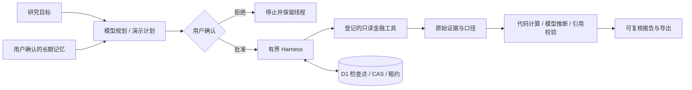

# 投资 X Buddy
一个面向投资研究者的个人 Agent 工作台：从研究目标出发，经计划确认、金融工具取数、证据校验，交付可复核报告，并保存检查点与显式记忆。

**当前交付状态以 [docs/STATUS.md](docs/STATUS.md) 为准。** 在线体验：[https://investment-x-buddy-lab.golden-robin-3691.chatgpt.site](https://investment-x-buddy-lab.golden-robin-3691.chatgpt.site)。源码：[https://github.com/YMLLBC/investment-x-buddy](https://github.com/YMLLBC/investment-x-buddy)。仓库中的构造演示数据可公开，真实供应商样本、访问码和 API 密钥不在源码或提交包中。

## 产品选择
- **公开演示**：三家 A 股公司的人为构造数据，真实运行状态机、数据库、审批和报告校验；不调用金融或模型接口。支持正常、现金流缺失、接口失败三种场景。
- **真实研究**：个人访问码保护。DeepSeek 规划和证据约束解读；扶摇获取金融字段，iFinD MCP 提供公司资料、公告和新闻。执行只读工具前由用户确认计划。
- **有据可查**：事实绑定原字段、数值和单位；计算由代码完成，模型文字仅是推断或未知。证据保留来源、数据时点、获取时点、口径、原始 JSON 和 SHA-256。
- **可暂停与继续**：D1 是研究状态的权威来源。版本 CAS 和租约防止多窗口重复执行与停止后迟到覆盖。关闭页面后不会持续调度；再次打开恢复保存的检查点。
- **长期记忆**：用户检查文本并明确确认后才写入。新研究快照继承当时的显式记忆；删除不改写历史快照。

## 技术与运行机制
React / TypeScript / Vinext / Vite / Cloudflare Workers / D1 / Drizzle。服务端调用外部 API，浏览器只访问本站 API；完整密钥不进入客户端。



内核在 `lib/buddy/harness.ts`，保持纯状态转换；数据适配在 `providers.ts/data.ts`，模型适配在 `model.ts`，存储与会话在 `repository.ts/auth.ts`，编排和 API 在 `engine.ts/server.ts` 及 `app/api/buddy/[...path]/route.ts`。工作台在 `components/buddy`。

默认最多 **24 次工具尝试、4 次模型调用、0.50 美元模型预算、15 分钟累计运行时间**。规划本身消耗模型调用与费用。金融调用 45 秒、模型 120 秒；瞬态错误最多 3 次总尝试，429 遵守重试间隔，鉴权和参数失败终止。恢复不重置计数、费用或起始时间。全站模型日预算默认 5 美元（UTC），请求前原子预留，实际用量结算；未知费用保留预留估算。金融工具计费以供应商账户为准。

上下文压缩保留目标、限制、用户记忆、证据 ID 和检查点；原始响应继续保存在 D1，摘要不替代证据。报告验证失败会明确暂停或失败，不返回正常成果。

## 本地启动
需要 Node.js 24（已验证 24.18.1）和 npm。Node 测试使用内置 `node:sqlite`；生产使用 D1。
```powershell
npm ci
Copy-Item .env.example .dev.vars
# 编辑 .dev.vars：填写私密配置，不提交到 Git
npm run db:generate
npm run build
node --import ./scripts/sites-env.mjs ./node_modules/wrangler/bin/wrangler.js d1 execute DB --local --config dist/server/wrangler.json --persist-to .wrangler/state --file drizzle/0000_brave_nicolaos.sql
npm run dev
```
默认本地地址 `http://127.0.0.1:5173`。仅首次空数据库应用该迁移；不要在已有库重放。后续 schema 变更追加新迁移，已发布迁移不可改写。Windows 若 npm 命令包装器解析异常，用已安装 npm 的绝对 `npm-cli.js` 经 Node 执行相同脚本；本项目不修改系统安装或 ACL。

将 `.env.example` 同时复制为 `.env.local` 可运行手动真实接口验证脚本；应用运行的私密变量来自 `.dev.vars` 或部署环境。即使仅运行演示也需要随机 `SESSION_SECRET`（至少 32 字符）和本地 DB。可用 `node -e "console.log(require('node:crypto').randomBytes(32).toString('hex'))"` 本地生成。

## 环境变量
| 变量 | 用途 |
| --- | --- |
| DEEPSEEK_API_KEY | DeepSeek 私密密钥 |
| DEEPSEEK_BASE_URL / DEEPSEEK_MODEL | 已验证 `https://api.deepseek.com` / `deepseek-flash` |
| DEEPSEEK_REASONING_EFFORT | 默认为 high |
| FUYAO_API_KEY | 扶摇 X-api-key |
| IFIND_API_KEY | iFinD MCP Authorization，原始 token，无 Bearer 前缀 |
| IFIND_MCP_BASE_URL | 已验证 HTTPS 固定服务器地址，见 example |
| RESEARCH_ACCESS_CODE | 个人真实研究访问码，不放在 URL 或源码 |
| SESSION_SECRET | 随机 HMAC 会话签名 secret，至少 32 字符 |
| MODEL_INPUT_USD_PER_MILLION / MODEL_CACHED_INPUT_USD_PER_MILLION / MODEL_OUTPUT_USD_PER_MILLION | 保守估价；不低于已验证 peak 0.3 / 0.006 / 1.2 |
| RUN_BUDGET_USD / DAILY_MODEL_BUDGET_USD | 只能收紧单研究 0.5 / 全站每日 5 美元上限 |

`DB` 为 D1 绑定，不是普通字符串变量。托管部署将真实值设为 secrets；`.env*`、`.dev.vars*`、`private-records` 和 `.cache` 全部排除 Git 和提交包。

## 数据来源与口径
[扶摇文档](https://fuyao.aicubes.cn/docs/)：[证券检索、行情快照、前复权日线、年度财务、估值、交易日历]；[iFinD MCP](https://mcp.51ifind.com/)：登记公司信息、公告、新闻；[DeepSeek Responses](https://api-docs.deepseek.com/guides/responses_api)：规划与解读。以实际发现和调用结果为准。

财务使用共同完整年度、CNY 元、合并净利润口径；最新共同年缺字段时明确说明回退，完全不完整则保留 null 与未知。财年和境内年末日期校验， unsafe 数值不得计算，派生值非有限则未知。请求最近 3 年不保证返回 3 年，短覆盖明确披露。估值仅有快照响应时点，不能冒充独立交易时点。iFinD 文本尚未统一核验每条原文日期，不作为已核验的数值事实。

## 验证
```powershell
npm test
npm run typecheck
npm run lint
npm run build
$env:PLAYWRIGHT_BROWSERS_PATH=(Join-Path (Get-Location) '.cache/playwright')
node node_modules/playwright/cli.js install chromium
npm run dev
# 在另一终端运行
npm run test:e2e
```
自动测试使用构造数据与内存 SQLite，不需要真实密钥，不伪造真实接口验收结果。外部真实验证需私密配置，脚本 `scripts/verify-live.mjs`、`scripts/probe-model.mjs`、`scripts/probe-review.mjs` 和 `scripts/verify-research.mjs` 会产生实际 API 用量；不要纳入默认 CI。真实结果写入忽略的私密缓存，公开文档只记录数量、状态、口径、错误及费用估算。

精确命令、预期、实际与失败修正见 [VALIDATION](docs/VALIDATION.md)、[测试说明](docs/TESTING.md)、[阶段报告](docs/STAGES.md)；源码最终发布前执行 `node scripts/check-secrets.mjs`，需本地真实私密值作为扫描候选，不输出候选本身。

## AI 的角色与已知边界
Codex 参与设计、实现、测试、独立审查、修正和文档；DeepSeek 是产品内的规划/推断模块，不是数字事实来源。完整记录见 [AI_USAGE](docs/AI_USAGE.md)。不会保存或展示隐藏推理，只显示工具步骤、执行摘要和用量。

这是访问码保护的个人原型：同浏览器签名会话保持身份，7 天到期；不是跨设备 OAuth 账户系统。无持仓、交易、支付、推送或持续后台任务。未完成正式披露的独立二次交叉核验，也不承诺所有金融数据权限长期可用。无确定涨跌、收益承诺或直接买卖建议。WebMCP 支持浏览器提供注册能力时的“读取状态”和“准备目标”，不绕过用户计划审批。

## 项目记录
[总体状态](docs/STATUS.md) · [实施计划](docs/IMPLEMENTATION_PLAN.md) · [关键接口](docs/DATA_AND_INTERFACES.md) · [AI记录](docs/AI_USAGE.md) · [验证记录](docs/VALIDATION.md) · [分阶段记录](docs/STAGES.md)。原题附件保留不改动。
